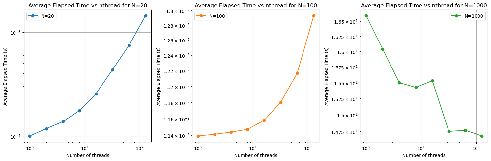
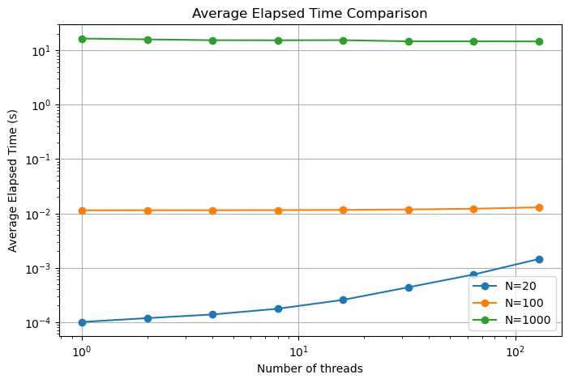
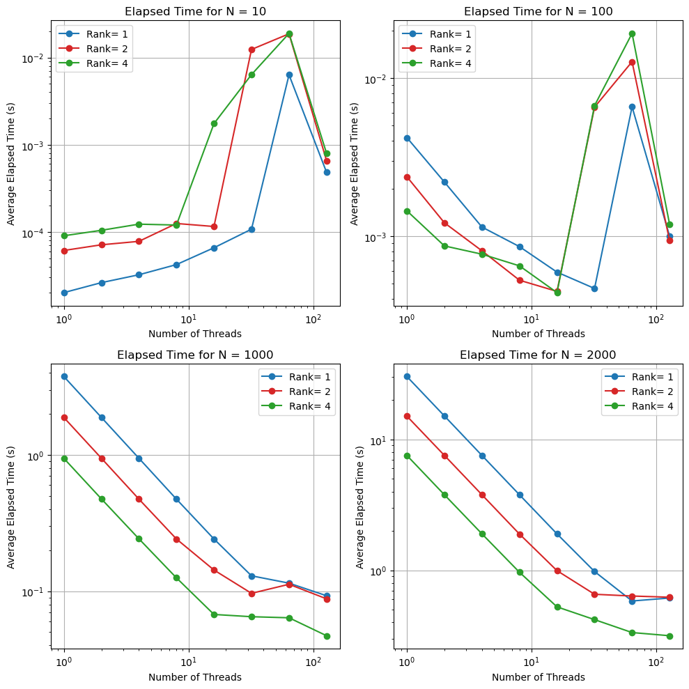

## Part 1: OpenMP Matrix-Matrix Multiplication

Question 1 and 2:
* Wall time for the OpenMP version: 0.0160184 s
* Wall time for the non-OpenMP version: 0.0159778 s 

Since both versions were executed with only one thread, and assuming they perform the same workload, the slight difference in wall times could be attributed to factors openMP setting up time, That is the reason why OpenMP version have slightly larger wall time.

Question 3 to 5:

The figures provided below compare the average elapsed time for various matrix sizes and different numbers of threads. It is observable that when the matrix size is relatively low, the overhead of managing multiple threads leads to an increase in runtime as the number of threads increases. However, when the matrix size reaches N=1000, a different trend becomes apparent. In this case, the runtime generally decreases as the number of threads increases.

<p align="center">
  
</p>


In the next figure, all results are compared together, and as expected, the average runtime increases with increasing matrix size.


<p align="center">
    
</p>


## Part 2: Adding OpenMP threading to a simple MPI application

```
Hello from MPI rank 0, thread 0 of 4
Hello from MPI rank 0, thread 3 of 4
Hello from MPI rank 0, thread 2 of 4
Hello from MPI rank 0, thread 1 of 4
Hello from MPI rank 1, thread 0 of 4
Hello from MPI rank 1, thread 3 of 4
Hello from MPI rank 1, thread 2 of 4
Hello from MPI rank 1, thread 1 of 4
```
The output indicates a successful execution of a parallel MPI + OpenMP program with 2 MPI ranks and 4 OpenMP threads per rank.

## Part 3: Hybrid Parallel Matrix Multiplication
Similar to part one, for smaller N sizes, parallelization with more threads and MPI ranks can result in slower code performance due to overhead. However, as the matrix sizes increase, parallelization approaches ideal scaling, resulting in improved performance and lower calculation time for a higher number of threads and ranks.

<p align="center">
    
</p>
